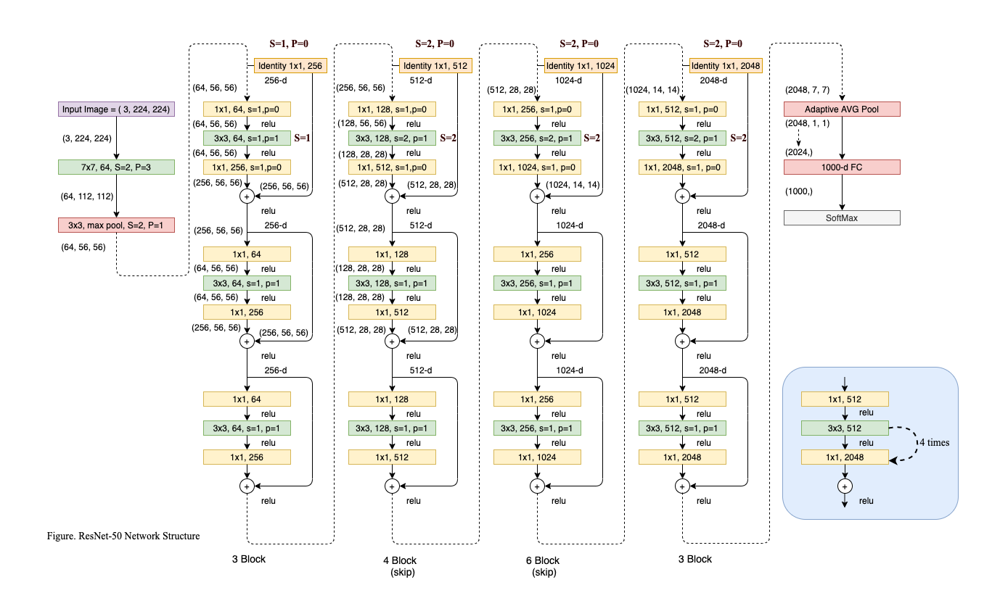
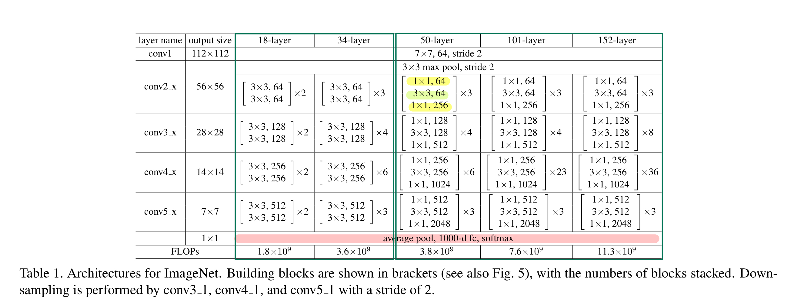
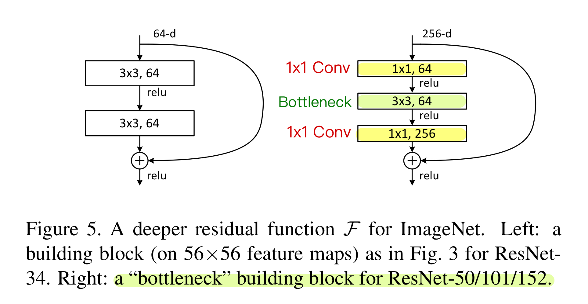

# RESNET

The Pytorch implementation for the ResNet paper: Deep Residual Learning for Image Recognition 


## Paper 
<a href="https://arxiv.org/abs/1512.03385">Deep Residual Learning for Image Recognition</a>


## Schematic diagram(ResNet-50)

<a href="https://drive.google.com/file/d/1B3T3Yv5_f4MvXlu5nG-AeByEMCV2N9QY/view?usp=sharing">ResNet-50 Schematic Diagram</a>

<div align="center">
  
</div>

## Structure

<div align="center">
  
</div>

<div align="center">
  
</div>


## Implement Keypoints

- **Resize** and **Cropping**
    - The image is resized with its shorter side randomly sampled in [256, 480] for scale augmentation. 
    - A 224×224 crop is randomly sampled from an image or its horizontal flip. 

- **Batch Normalization (BN)** 
    - Adopt batch normalization (BN) right after each convolution and before activation. 
    - Does not need **bias term**
    - Does not use **dropout**

- **1x1 Conv**
    - The 1x1 Conv are responsible for reducing and then increasing (restoring) dimensions.
    - The 1x1 Conv greatly reduce the parameter numbers, save a lot of computation.
    - The 1x1 Conv can well replace the function of pooling.
    - The 1x1 Conv does not change the **HEIGHT** and **WIDTH**, but change the **CHANNEL Numbers**.

- **Residual Block**
    - Residual Block design (Deeper Bottleneck Architectures)
    - The parameter-free **identity shortcuts**
        - itentity projection cause lower complexity 

    - Why residual block is a good idea to solve **gradient vanishing**?
        - Residual Block provide greater **Gradient Flow**.
        - Adding the Identity (shortcuts connection) can let network more easlier to learn the **identical projection** 
        - In backprogation, multiplying many Jocobian would let output close to zero or infinity, but we hope it can close to one (J == I)
        - In backprogation, let machine learn a projection of ``F(x) = x`` is difficult than learn a ``F(x) = 0`` (hint: count the minimum loss), and hence, we can design the network structure as `H(x) = F(x) + x`
            - x is residual itentity input 
            - F is the projection network need to learn
            - H is the entire output in residual block 
            - so that, F(x) would be tiny enough, and H(x) == x is easlier to train.


- Average Pooling
    - Average Pooling replace the Giant FC layers


## Repository Content
### pytorch script 
- `ResNet.py` models structure
- `test.py` function testing 
- `train.py` train models


### jupyter notebooks

Check the entire project in jupyter notebooks

- terminal command ```jupyter notebook``` and open `ResNet.ipynb` run from top to down


### Prequesites
- Python 3.8
- Pytorch 1.8.1
