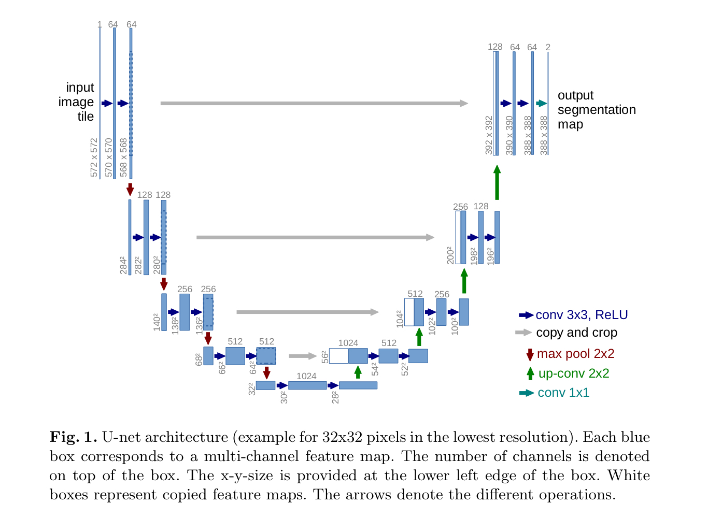

# U-Net

The Pytorch implementation for the U-Net paper: Convolutional Networks for Biomedical Image Segmentation

## Paper 
<a href="https://arxiv.org/abs/1505.04597">U-Net: Convolutional Networks for Biomedical Image Segmentation</a>


## Schematic diagram


<div align="center">
  
</div>


## Structure


<!-- <div align="center">
  
</div>

<div align="center">
  
</div>
 -->

*- U-Net: Convolutional Networks for Biomedical Image Segmentation -*

The network architecture is illustrated in Figure 1. It consists of a contracting
path (left side) and an expansive path (right side). The contracting path follows
the typical architecture of a convolutional network. It consists of the repeated
application of **two 3x3 convolutions** (unpadded convolutions), each followed by
a rectified linear unit **(ReLU)** and **a 2x2 max pooling operation with stride 2
for downsampling**. At each downsampling step we double the number of feature
channels. Every step in the expansive path consists of an upsampling of the
feature map followed by a **2x2 convolution** (“up-convolution”) that halves the
number of feature channels, a concatenation with the correspondingly cropped
feature map from the contracting path, and **two 3x3 convolutions**, each followed by a **ReLU**. The **cropping** is necessary due to the loss of border pixels in
every convolution. At the final layer a **1x1 convolution** is used to map each 64-
component feature vector to the desired number of classes. In total the network
has 23 convolutional layers.

To allow a seamless tiling of the output segmentation map (see Figure 2), it
is important to select the input tile size such that all 2x2 max-pooling operations
are applied to a layer with an even x- and y-size.

## Implement Keypoints


#### U-Net architecture usually uses 3 channel input size for RGB image processing and 1 channel output size.

- Down Path 
    - Double Conv with kernel_size=3, stride=1, padding=1
    - MaxPool with kernel_size=2, stride=2

- Up Path 
    - ConvTranspose2d with kernel_size=2, stride=2
    - concatenate the skip connection along the channel dimension, dim=1 (channel-wise dimension feature concat)
    - Double Conv with kernel_size=3, stride=1, padding=1

- Bottleneck
    - Double Conv with kernel_size=3, stride=1, padding=1

- Last Layer
    - The last layer is a 1x1 Conv, used to map each 64-
component feature vector to the desired number of classes.
    - Because the output would be binary, so set out_channels= 1 as default.

#### Others

- In this implementation, the input pixels size and the output pixels size should be the same.( However, the original paper is not )
    - i.g. (1, 3, 572, 572) -> (1, 1, 572, 572)
        - batch_size = 3 
        - channel_size = 1 
        - kernel_size = 572x572

- Add BatchNorm2d which is not used in original papers (However, the BatchNorm2d concept was introduced after Unet...)

- Due to the unpadded convolutions, the output image is smaller than the input
by a constant border width.  *- U-Net -*
    - The original paper use **unpadded conv** in DoubleConv part, so every time doing the convolution it will have some pixels loss. 
    - To solve the loss issue, the authors also introduce a weight formula( Mirror Padding?).

    - However, in our implementation, we use the **"same" convolution** with **padding=1**.
    - Besides, we use `torchvision.transforms.functional.resize` to replace the cropping.

- The energy function is computed by a pixel-wise soft-max over the final feature map combined with the cross entropy loss function. (TBA)


- [albumentations](https://github.com/albumentations-team/albumentations) : Fast image augmentation library and an easy-to-use wrapper around other libraries.   
https://github.com/albumentations-team/albumentations


- Segmentation is a multilabel question not a multiclassification question, however, each label can be taken as binary classification, and sum each loss from each label to compute the total loss.

```python
# --- Multiple case --- 
n = 3
model = UNet(in_channels=3, out_channels=N).to(DEVICE)
loss_func = nn.CrossEntropyLoss()

# --- Binary case --- 
model = UNet(in_channels=3, out_channels=1).to(DEVICE)
loss_func = nn.BCEWithLogitsLoss() # do sigmoid + BCE 
```

## Repository Content

### pytorch script 
- `model.py` models structure
- `dataset.py` function for loading data
- `utils.py` function for some tools like saving img, save and load checkpoints
- `train.py` train models


### jupyter notebooks (TBA)

Check the entire project in jupyter notebooks

- terminal command ```jupyter notebook``` and open `U-Net.ipynb` run from top to down


### Prequesites
- Python 3.8
- Pytorch 1.8.1